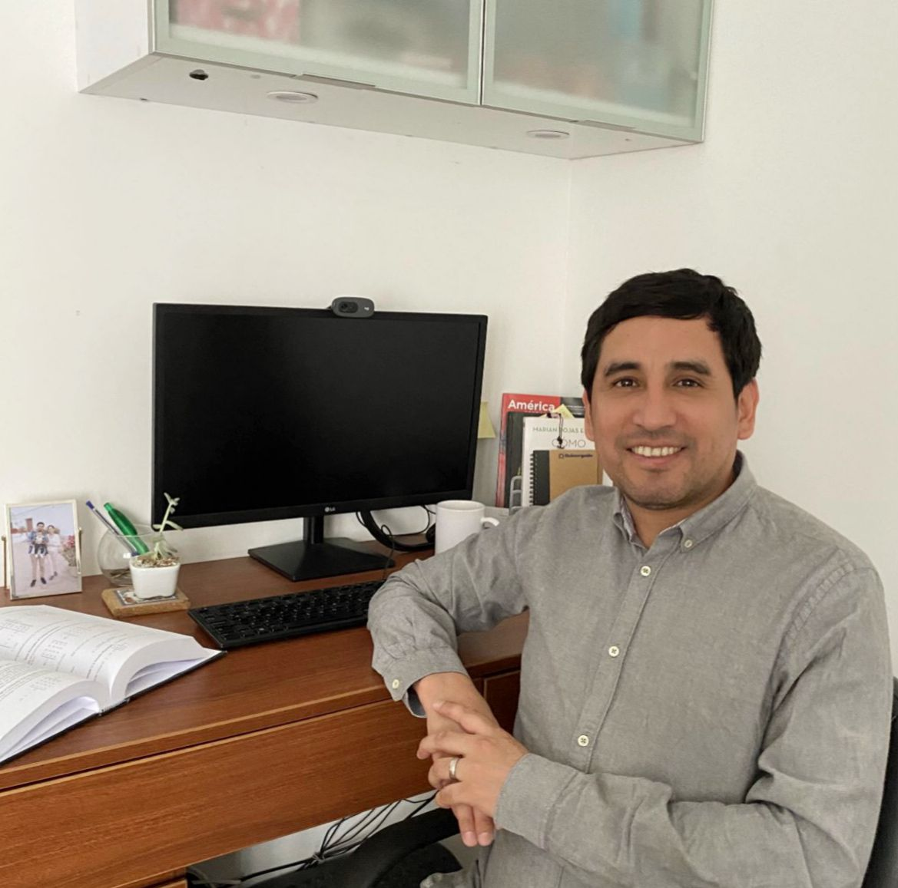

# juanorosco.github.io
---
# Feel free to add content and custom Front Matter to this file.
# To modify the layout, see https://jekyllrb.com/docs/themes/#overriding-theme-defaults

layout: home
sitemap: true
---

I am a PhD student at Universidad Carlos III de Madrid in Mathematical Engineering

My research interests are:

  * Time Series
  * Data Panel
  * Stochastic Frontier
  * Machine Learning
  * Econometrics Model

[CV](https://raw.githubusercontent.com/juan7ka/aboutme/filess/cv.pdf)

[Linkedin](https://www.linkedin.com/in/juancaorosco)
